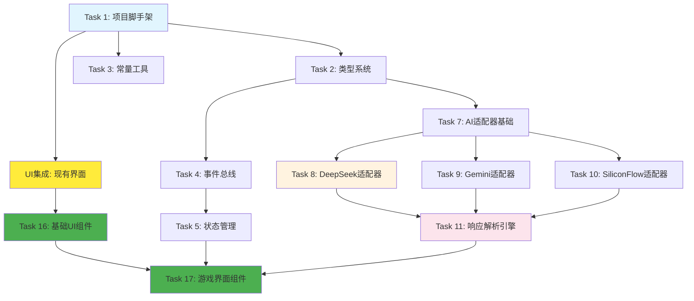

# AI文字游戏渲染器 - 模块化开发任务计划

## 项目概述
基于docs文件夹中的需求文档、系统架构设计、API接口文档等，制定模块化开发任务计划。

## 模块化开发策略
采用渐进式模块开发，每个模块独立开发、测试，然后集成。优先开发核心模块，再扩展功能模块。

---

## 任务依赖关系图



**UI先行策略路径**: Task 1 → UI集成 → Task 16 → Task 17 (界面先行)  
**核心功能路径**: Task 2 → Task 7 → Task 8/9/10 → Task 11 (逻辑后置)  
**并行开发机会**: UI线(Task 1→UI→16→17) 与 架构线(Task 2→3→4) 可并行  
**集成测试节点**: Task 17 是UI和逻辑的集成测试点

## 风险评估与缓解策略

### 高风险任务 🔴
| 任务 | 风险点 | 概率 | 影响 | 缓解策略 |
|------|--------|------|------|----------|
| Task 11 | AI响应格式变化 | 高 | 高 | 1. 预先收集各种异常响应样本<br>2. 建立完善的测试用例<br>3. 设计灵活的解析策略 |
| Task 8-10 | AI服务商政策变更 | 中 | 高 | 1. 监控三个主要服务商API变更<br>2. 实现适配器模式便于切换<br>3. 准备服务商间的降级方案 |

### 中风险任务 🟡  
| 任务 | 风险点 | 缓解策略 |
|------|--------|----------|
| Task 5 | 状态管理复杂度 | 分阶段实现，先简单后复杂 |
| Task 20-23 | 扩展卡片系统设计 | 提前做技术调研和原型验证 |

### 技术债务预警 ⚠️
- **过度抽象**: 适配器模式不要过早抽象，先实现2-3个再总结
- **状态管理**: Zustand+Jotai+React Query 组合可能产生状态同步问题
- **类型系统**: TypeScript类型定义要渐进完善，避免前期过度设计

## 开发任务规划

### 阶段一：项目基础设施（Foundation）

#### Task 1: 项目脚手架搭建
- [x] 初始化Vite + React + TypeScript项目 *📖 系统架构设计文档.md → 2.1节 核心框架*
- [x] 配置Tailwind CSS、ESLint、Prettier *📖 系统架构设计文档.md → 2.1.3节 UI组件库*
- [x] 设置项目目录结构（按架构文档规划） *📖 系统架构设计文档.md → 4.1节 项目目录结构*
- [x] 配置开发环境和构建脚本 *📖 系统架构设计文档.md → 9.1节 开发流程*
- [x] Git初始化和基础配置 *📖 系统架构设计文档.md → 9.1节 开发流程*

#### UI集成: 现有界面集成 (并行于Task 2-3)

**依赖**: Task 1 (项目脚手架)  
**预估工时**: 2-3天  
**风险等级**: 中等 (技术栈兼容性)

##### UI.1 现有界面评估 (0.5天) ✅
- [x] 分析现有UI的技术栈兼容性(React/Vue/其他)
- [x] 评估组件结构和样式方案(CSS/Tailwind/其他)
- [x] 识别四个固定区域在现有UI中的布局
- [x] 检查移动端适配和响应式设计完整性
- **验收标准**:
  - [x] 技术栈兼容性报告完成 (87.5%兼容，仅需Next.js→Vite迁移)
  - [x] UI组件结构清单完成 (完整的基础UI+游戏组件+移动端组件)
  - [x] 区域功能映射表完成 (四个固定区域完全匹配需求)

##### UI.2 界面迁移集成 (1.5天) ✅
- [x] 现有UI组件迁移到项目框架中
- [x] 适配TypeScript类型定义
- [x] 确保与Tailwind CSS样式系统兼容
- [x] 设置基础的Mock数据展示
- **验收标准**:
  - [x] 四个游戏区域正常显示 (场景、旁白、选项、状态栏)
  - [x] 基础交互功能(按钮点击、输入框)可用 (模拟AI响应)
  - [x] 样式和布局在桌面和移动端正常 (响应式布局完整)

##### UI.3 基础交互框架 (1天) ✅
- [x] 添加简单的状态管理Hook
- [x] 实现基础的事件处理机制
- [x] 创建Mock数据更新的测试接口
- [x] 设置界面更新的验证机制
- **验收标准**:
  - [x] 能够通过程序代码更新界面显示
  - [x] 用户交互能触发相应的事件处理
  - [x] Mock数据变化能实时反映到界面
- **实际交付**: 
  - [x] 完整的Zustand状态管理系统 (gameStore.ts)
  - [x] 事件总线机制 (eventBus.ts) 
  - [x] Mock API和游戏控制器 (mockApi.ts)
  - [x] 状态调试工具组件 (StateDebugger.tsx)
  - [x] 使用Playwright验证状态管理系统功能

#### Task 2: 类型系统建设
- [ ] 创建核心数据类型定义（types/目录） *📖 API接口文档.md → 4节 数据结构定义*
- [ ] 游戏相关类型（UserInput、GameState、AIResponse等） *📖 API接口文档.md → 4.1节 游戏数据结构*
- [ ] 配置相关类型（WorldConfig、StatusConfig、AIConfig等） *📖 API接口文档.md → 4.2节 配置数据结构*
- [ ] 错误处理类型（ErrorCode、ProcessedError等） *📖 错误分类与重试策略文档.md → 2节 具体错误类型定义*
- [ ] 接口和枚举定义 *📖 API接口文档.md → 3节 内部模块接口*

#### Task 3: 常量和工具函数
- [ ] 创建常量定义（constants/目录） *📖 API接口文档.md → 6.2节 数据大小限制*
- [ ] 错误码定义 *📖 错误分类与重试策略文档.md → 1节 错误分类体系*
- [ ] 默认配置常量 *📖 API接口文档.md → 6.2节 系统配置参数*
- [ ] 基础工具函数库（utils/目录） *📖 API接口文档.md → 7.3节 测试工具类*

### 阶段二：核心引擎模块（Core Engine）

#### Task 4: 事件总线系统
- [ ] 实现事件总线核心类 *📖 API接口文档.md → 3.5节 事件总线接口*
- [ ] 事件订阅/发布机制 *📖 API接口文档.md → 3.5节 EventBusAPI*
- [ ] 事件类型定义 *📖 API接口文档.md → 3.5节 核心游戏事件*
- [ ] 模块间通信接口 *📖 系统架构设计文档.md → 4.2节 模块通信机制*

#### Task 5: 游戏状态管理
- [ ] 使用Zustand创建游戏状态store *📖 系统架构设计文档.md → 2.1.2节 状态管理*
- [ ] 实现状态更新逻辑 *📖 API接口文档.md → 3.1.2节 StateManager API*
- [ ] 历史记录管理 *📖 需求文档详细版.md → 5.1节 游戏存档*
- [ ] 状态快照和回滚功能 *📖 API接口文档.md → 3.1.2节 回滚功能*

#### Task 6: 数据处理引擎
- [ ] Prompt组装器 *📖 数据流动格式规范.md → 2.1节 完整的Prompt格式*
- [ ] AI响应解析器 *📖 数据流动格式规范.md → 4.1节 AI响应解析处理*
- [ ] 数据验证器 *📖 数据流动格式规范.md → 4.1节 校验和修复策略*
- [ ] 格式转换工具 *📖 数据流动格式规范.md → 4.1节 轻修补策略*

### 阶段三：AI服务集成模块（AI Service）

#### Task 7: AI服务适配器基础架构
- [ ] 定义统一的AIServiceAdapter接口 *📖 API接口文档.md → 2.1节 统一AI服务接口*
- [ ] 实现连接管理基类 *📖 API接口文档.md → 2.1.1节 AIServiceAdapter接口定义*
- [ ] 请求/响应处理基类 *📖 API接口文档.md → 2.1.2节 请求格式 + 2.1.3节 响应格式*
- [ ] 错误处理基类 *📖 错误分类与重试策略文档.md → 5.2节 错误处理接口*

#### Task 8: DeepSeek适配器开发

**依赖**: Task 7 (AI服务适配器基础架构)  
**预估工时**: 5-7天  
**风险等级**: 中等 (推理模式和KV缓存难点)

##### 8.1 DeepSeek连接配置 (1天)
- [ ] 创建DeepSeek配置接口 `DeepSeekConfig` *📖 API接口文档.md → 4.2.2节 AI配置数据*
- [ ] 实现API密钥验证逻辑 *📖 API接口文档.md → 2.2.1节 DeepSeek API集成*
- [ ] 添加连接测试功能 *📖 需求文档详细版.md → 2.3.3节 连接测试*
- [ ] 支持推理模式开关配置
- **验收标准**: 
  - [ ] 配置接口符合统一规范
  - [ ] 支持无效密钥检测
  - [ ] 连接测试能返回明确状态
  - [ ] 推理模式配置生效

##### 8.2 请求构建器 (1天)  
- [ ] 实现 `buildDeepSeekRequest()` 方法 *📖 API接口文档.md → 2.2.1节 DeepSeek API集成*
- [ ] 支持deepseek-chat和deepseek-reasoner模型切换 *📖 需求文档详细版.md → 2.3.1节 支持的AI服务*
- [ ] 处理temperature、max_tokens等参数 *📖 API接口文档.md → 4.2.2节 AIParameters*
- [ ] 实现KV缓存优化配置
- **接口契约**:
```typescript
interface DeepSeekRequestBuilder {
  buildRequest(prompt: string, config: RequestConfig): DeepSeekRequestBody;
  enableReasoningMode(enabled: boolean): void;
}
```
- **验收标准**:
  - [ ] 请求格式符合DeepSeek API规范
  - [ ] 参数验证和边界处理
  - [ ] KV缓存配置正确传递
  - [ ] 单元测试覆盖率>90%

##### 8.3 响应解析器 (2天)
- [ ] 实现 `parseDeepSeekResponse()` 方法 *📖 API接口文档.md → 2.2.1节 DeepSeek API集成*  
- [ ] 处理推理模式的思考过程输出
- [ ] 提取usage统计信息 *📖 需求文档详细版.md → 2.3.3节 使用量统计*
- [ ] 处理OpenAI格式兼容性
- **技术难点**: 
  - 推理模式的思考内容解析
  - KV缓存响应的成本计算
- **验收标准**:
  - [ ] 能正确解析正常响应
  - [ ] 能处理推理模式的额外输出
  - [ ] Token使用量统计准确

##### 8.4 错误处理 (1天)
- [ ] 映射DeepSeek错误码到统一错误码 *📖 错误分类与重试策略文档.md → 2.3节 AI调用错误*
- [ ] 实现重试策略 *📖 错误分类与重试策略文档.md → 3节 重试策略框架*
- [ ] 处理DeepSeek特定错误（KV缓存错误、推理模式失败等）
- **错误映射表**:
  - `invalid_api_key` → `3010`  
  - `rate_limit_exceeded` → `3011`
  - `kv_cache_error` → `3012`
  - `reasoning_mode_failed` → `3013`
- **验收标准**:
  - [ ] 所有DeepSeek错误码都有对应处理
  - [ ] 重试策略按配置执行
  - [ ] 错误信息对用户友好

#### Task 9: Gemini适配器开发

**依赖**: Task 7 (AI服务适配器基础架构)  
**预估工时**: 6-8天  
**风险等级**: 中等 (多模态和安全过滤器复杂度)

- [ ] 实现Gemini API连接和OAuth 2.0认证
- [ ] 支持gemini-2.5-flash等模型切换
- [ ] 处理多模态输入（文本、图片）
- [ ] 实现上下文缓存优化
- [ ] 处理Google特有的安全过滤器
- [ ] 映射Gemini错误码（3020-3029范围）
- [ ] 支持Live API实时交互（可选）

#### Task 10: SiliconFlow适配器开发

**依赖**: Task 7 (AI服务适配器基础架构)  
**预估工时**: 5-7天  
**风险等级**: 中等 (多模型切换复杂度)

- [ ] 实现SiliconFlow API连接
- [ ] 支持多种底层模型（Qwen、GLM、Llama等）
- [ ] 实现智能模型切换策略
- [ ] 支持批处理请求优化
- [ ] 处理模型可用性检测
- [ ] 映射SiliconFlow错误码（3030-3039范围）
- [ ] 实现负载均衡和故障转移

#### Task 11: AI响应解析引擎
- [ ] JSON提取和解析
- [ ] 四步错误处理：约束→校验→兜底→重试
- [ ] 字段映射和修复
- [ ] 默认值填充

### 阶段四：配置管理模块（Configuration）

#### Task 12: 世界观配置系统
- [ ] 世界观编辑器组件 *📖 需求文档详细版.md → 2.4.1节 世界观编辑器*
- [ ] 配置验证规则 *📖 API接口文档.md → 3.2节 ConfigManager API → validateConfig*
- [ ] 配置保存/加载 *📖 API接口文档.md → 3.2.2节 世界观配置接口*
- [ ] 预设模板系统 *📖 需求文档详细版.md → 2.4.2节 预设模板*

#### Task 13: 状态栏配置系统
- [ ] 状态字段定义编辑器 *📖 需求文档详细版.md → 2.4.2节 状态栏配置器*
- [ ] 字段类型支持（进度条、数值、等级等） *📖 API接口文档.md → 3.2.3节 StatusField → FieldType*
- [ ] 初始值设置 *📖 数据流动格式规范.md → 1.3节 状态栏配置*
- [ ] 配置预览功能 *📖 需求文档详细版.md → 2.1.4节 角色状态区*

#### Task 14: AI配置管理
- [ ] AI服务配置界面 *📖 需求文档详细版.md → 3.3.2节 连接配置项*
- [ ] 连接测试功能 *📖 需求文档详细版.md → 3.3.3节 连接测试*
- [ ] 密钥安全存储 *📖 需求文档详细版.md → 4.3节 数据安全*
- [ ] 配置验证和提示 *📖 API接口文档.md → 3.2节 ConfigManager API*

#### Task 15: 预设管理系统
- [ ] 预设创建/编辑/删除 *📖 需求文档详细版.md → 2.4.3节 预设管理*
- [ ] 预设导入/导出 *📖 需求文档详细版.md → 2.5.2节 导入导出功能*
- [ ] 示例预设库 *📖 需求文档详细版.md → 2.4.3节 示例预设*
- [ ] 版本兼容性处理 *📖 API接口文档.md → 4.3.2节 导入导出数据 → ImportOptions*

### 阶段五：用户界面模块（UI Components）

#### Task 16: 基础UI组件库
- [ ] 按钮、输入框、选择器等基础组件 *📖 系统架构设计文档.md → 2.1.3节 UI组件库*
- [ ] 模态框、通知、加载状态组件 *📖 需求文档详细版.md → 4.1节 状态反馈*
- [ ] 表单组件和验证 *📖 系统架构设计文档.md → 2.1.4节 React Hook Form*
- [ ] 图标系统 *📖 需求文档详细版.md → 2.6.1节 视觉风格*

#### Task 17: 游戏界面核心组件
- [ ] 场景描述区组件 *📖 需求文档详细版.md → 2.1.1节 场景描述区*
- [ ] 旁白区组件 *📖 需求文档详细版.md → 2.1.2节 旁白区*
- [ ] 行动选择区组件（固定3个选项） *📖 需求文档详细版.md → 2.1.3节 行动选择区*
- [ ] 角色状态栏组件 *📖 需求文档详细版.md → 2.1.4节 角色状态区*

#### Task 18: 布局管理系统
- [ ] 响应式布局组件 *📖 需求文档详细版.md → 2.6.2节 响应式布局*
- [ ] 桌面端三栏布局 *📖 需求文档详细版.md → 2.6.2节 桌面端*
- [ ] 移动端抽屉布局 *📖 需求文档详细版.md → 2.6.2节 手机端*
- [ ] 布局切换逻辑 *📖 API接口文档.md → 3.3节 UIRenderer API → switchLayout*

#### Task 19: 动画系统
- [ ] 集成Framer Motion *📖 系统架构设计文档.md → 2.1.3节 Framer Motion*
- [ ] 页面过渡动画 *📖 需求文档详细版.md → 4.1节 平滑动画*
- [ ] 组件状态动画 *📖 API接口文档.md → 3.3节 UIRenderer API → addAnimation*
- [ ] 性能优化 *📖 系统架构设计文档.md → 6.2.2节 渲染性能*

### 阶段六：扩展卡片系统（Extension Cards）

#### Task 20: 卡片架构设计
- [ ] 卡片工厂模式实现 *📖 API接口文档.md → 3.3.2节 组件渲染接口 → renderExtensionCard*
- [ ] 卡片类型定义 *📖 API接口文档.md → 4.1.4节 自定义扩展数据 → ExtensionType*
- [ ] 卡片渲染器基类 *📖 需求文档详细版.md → 2.2.1节 卡片配置功能*
- [ ] 数据绑定机制 *📖 需求文档详细版.md → 2.2.1节 解析规则*

#### Task 21: 卡片类型实现
- [ ] 列表类型卡片（背包、任务等） *📖 需求文档详细版.md → 2.2.3节 常见卡片类型示例 → 背包物品*
- [ ] 键值对类型卡片（好感度、属性等） *📖 需求文档详细版.md → 2.2.3节 人物关系*
- [ ] 进度类型卡片（技能、成就等） *📖 需求文档详细版.md → 2.2.3节 技能等级*
- [ ] 自定义类型卡片 *📖 API接口文档.md → 4.1.4节 ExtensionType.CUSTOM*

#### Task 22: 卡片配置系统
- [ ] 卡片配置编辑器 *📖 需求文档详细版.md → 2.2.1节 卡片配置功能*
- [ ] 位置和样式设置 *📖 API接口文档.md → 4.1.4节 CardPosition*
- [ ] 数据类型配置 *📖 API接口文档.md → 4.1.4节 DataType*
- [ ] 显示格式选择 *📖 需求文档详细版.md → 2.2.1节 显示格式*

#### Task 23: 卡片布局管理
- [ ] 左右侧栏布局 *📖 需求文档详细版.md → 2.2.1节 显示位置*
- [ ] 卡片拖拽排序 *📖 需求文档详细版.md → 2.2.1节 排序规则*
- [ ] 移动端适配 *📖 需求文档详细版.md → 2.2.2节 移动端*
- [ ] 卡片收起/展开 *📖 需求文档详细版.md → 2.2.2节 内容过长*

### 阶段七：数据存储模块（Storage）

#### Task 24: 本地存储封装
- [ ] localStorage/IndexedDB封装 *📖 API接口文档.md → 3.4节 存储管理接口*
- [ ] 数据序列化/反序列化 *📖 数据流动格式规范.md → 4.2节 内部存储格式*
- [ ] 存储配额管理 *📖 API接口文档.md → 3.4.1节 StorageStats*
- [ ] 数据压缩 *📖 需求文档详细版.md → 4.2节 历史数据压缩*

#### Task 25: 游戏历史管理
- [ ] 回合数据存储 *📖 数据流动格式规范.md → 4.2节 内部存储格式*
- [ ] 历史记录浏览 *📖 需求文档详细版.md → 5.1节 历史浏览*
- [ ] 数据压缩策略（100回合限制） *📖 需求文档详细版.md → 5.1节 存档限制*
- [ ] 历史摘要生成 *📖 需求文档详细版.md → 4.2节 历史数据压缩*

#### Task 26: 导入导出系统
- [ ] 数据导出功能
- [ ] 数据导入和验证
- [ ] 版本兼容性处理
- [ ] 文件格式定义

#### Task 27: 缓存管理
- [ ] 配置缓存
- [ ] AI响应缓存
- [ ] 图片资源缓存
- [ ] 缓存清理策略

### 阶段八：错误处理和监控（Error Handling）

#### Task 28: 全局错误处理系统
- [ ] 错误捕获和分类
- [ ] 错误恢复机制
- [ ] 用户友好提示
- [ ] 错误日志记录

#### Task 29: 重试策略系统
- [ ] 指数退避重试
- [ ] 线性重试
- [ ] 自定义重试策略
- [ ] 熔断器模式

#### Task 30: 性能监控
- [ ] API调用监控
- [ ] 渲染性能监控
- [ ] 内存使用监控
- [ ] 用户行为统计

### 阶段九：主题和国际化（Theming & i18n）

#### Task 31: 主题系统
- [ ] 主题配置结构
- [ ] 多套预设主题
- [ ] 自定义主题编辑器
- [ ] 暗黑模式支持

#### Task 32: 国际化支持
- [ ] 多语言文件管理
- [ ] 组件文本国际化
- [ ] 日期格式本地化
- [ ] RTL语言支持

### 阶段十：测试和部署（Testing & Deployment）

#### Task 33: 单元测试
- [ ] 核心模块单元测试
- [ ] AI适配器测试
- [ ] 配置管理测试
- [ ] 工具函数测试

#### Task 34: 集成测试
- [ ] 模块间集成测试
- [ ] 数据流测试
- [ ] 错误处理测试
- [ ] 性能测试

#### Task 35: E2E测试
- [ ] 用户操作流程测试
- [ ] 游戏完整流程测试
- [ ] 多浏览器兼容测试
- [ ] 移动端测试

#### Task 36: CI/CD和部署
- [ ] GitHub Actions配置
- [ ] 自动化测试流程
- [ ] 构建和部署脚本
- [ ] 生产环境优化

---

## 开发里程碑

### 里程碑 1: MVP版本 (UI集成 + Tasks 1-18)
- **UI界面先行**: 现有界面集成和基础交互
- **基础项目结构**: 脚手架、类型系统、工具函数
- **核心AI对话功能**: DeepSeek适配器和响应解析
- **四个固定区域显示**: 场景、旁白、选项、状态栏
- **状态管理集成**: UI界面与业务逻辑的数据绑定
- **可视化验证**: 每个模块完成后的界面测试

**预期交付**: 具有完整UI界面的可交互AI文字游戏版本

### 里程碑 2: 功能完整版 (Tasks 19-27)
- 扩展卡片系统
- 完整配置管理
- 数据存储和历史
- 导入导出功能
- 响应式界面

**预期交付**: 功能完整的产品版本

### 里程碑 3: 产品级版本 (Tasks 28-36)
- 错误处理和监控
- 主题系统
- 国际化支持
- 完整测试覆盖
- 生产部署

**预期交付**: 可正式发布的产品

---

## 开发规范

### 代码规范
- 使用TypeScript严格模式
- 遵循ESLint + Prettier规则
- 组件使用函数式组件和Hooks
- 文件和函数命名使用驼峰命名

### 测试规范
- 单元测试覆盖率 > 80%
- 关键模块必须有集成测试
- 用户核心流程必须有E2E测试
- 性能测试和安全测试

### 提交规范
- 使用Conventional Commits格式
- 每个Task完成后提交
- 定期进行代码评审
- 保持commit历史清晰

### 模块独立性原则
- 每个模块有清晰的接口定义
- 模块间通过事件总线通信
- 避免循环依赖
- 支持模块的热插拔

---

*此文档将随着开发进展持续更新*